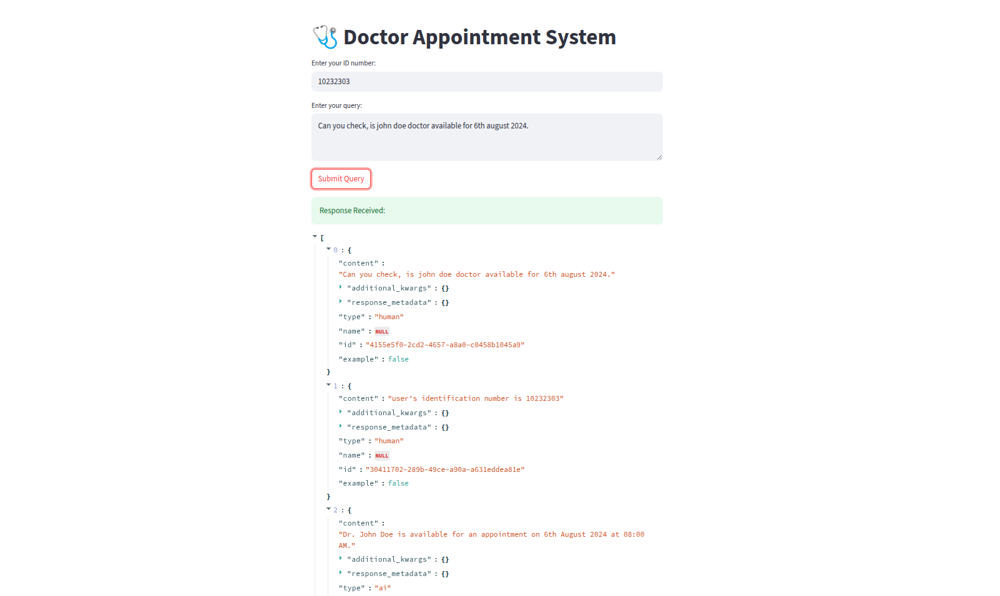

# Doctor Appointment Assistant (MAS BASED)

This project implements a **LangGraph-powered multi-agent system** that handles appointment **booking**, **cancellation**, **rescheduling**, and **availability checking** for doctors. It uses **LangChain**, **LangGraph**, and **OpenAI/Groq LLMs**, with tool-augmented agents and stateful routing logic.



---

## 📁 Project Structure

```
.
├── app/
│   ├── api/               # FastAPI app
│   ├── llm/               # LangChain config and models
│   ├── prompts/           # Prompt engineering utilities
│   ├── schemas/           # Pydantic models for validation
│   └── toolkit/           # Tool functions for appointment handling
├── data/availability.csv  # Slot data
├── notebooks/             # Experiments (LangGraph agents etc.)
├── ui/streamlit_ui.py     # Streamlit frontend
├── main.py                # Main app launcher
├── pyproject.toml         # Project dependencies
└── README.md              # Project overview and setup
```

---

## 🧠 Features

- ✅ **Multi-agent architecture** using LangGraph
- 🛠️ Tools for:
  - Check availability by **doctor** or **specialization**
  - **Set**, **cancel**, or **reschedule** appointments
- 💬 LangChain ReAct agents backed by:
  - `gpt-4o` (OpenAI)
  - `kimi-k2-instruct` (Groq)
- 📅 Validations for time/date, doctor names, and patient ID numbers
- ⚙️ Supervisor agent routes user queries to the right node: `booking_node`, `information_node`, or `FINISH`

---

## 🧪 Installation

### 1. Clone the repository

```bash
git clone https://github.com/dixitrivedi/doctor-appointment-multi-agent-app.git
cd doctor-appointment-multi-agent-app
```

### 2. Install dependencies

```bash
pip install -r requirements.txt
```

### 3. Set up environment variables

Create a `.env` file in the root directory:

```env
OPENAI_API_KEY=your_openai_key
GROQ_API_KEY=your_groq_key
```

---

## 🚀 Running the API

### Start the FastAPI server:

From project root:

```bash
uvicorn app.api.fastai_api:app --reload
```

---

## 📓 Running the Notebook

To explore agent orchestration via LangGraph, open:

```bash
notebooks/experiment.ipynb
```

---

## ⚒️ Available Tools

| Tool Name                     | Description                                        |
|------------------------------|----------------------------------------------------|
| `check_availability_by_doctor`         | Checks if a specific doctor is available         |
| `check_availability_by_specialization` | Lists available doctors by specialization        |
| `set_appointment`            | Books an appointment if slot is available         |
| `cancel_appointment`         | Cancels a previously booked appointment           |
| `reschedule_appointment`     | Reschedules an existing appointment               |

---

## 🧪 Example Use Case

```python
from langchain_core.messages import HumanMessage

state = {
    "messages": [HumanMessage(content="Can you book a slot with Dr. John Doe on 07-08-2024 at 8:30 AM?")],
    "id_number": 1000097
}

result = app.invoke(state)
print(result["messages"][-1].content)
```

---

## 📊 Data Format

**`availability.csv`** example:

| date_slot       | doctor_name    | specialization     | is_available | patient_to_attend |
|-----------------|----------------|--------------------|--------------|-------------------|
| 07-08-2024 08:30| john doe       | orthodontist       | True         |                   |

---

## 🛡 Validation

Using Pydantic models to ensure:

- Date format: `DD-MM-YYYY` or `DD-MM-YYYY HH:MM`
- ID number: 7–8 digits
- Names are from a predefined list (using `Literal`)

---
